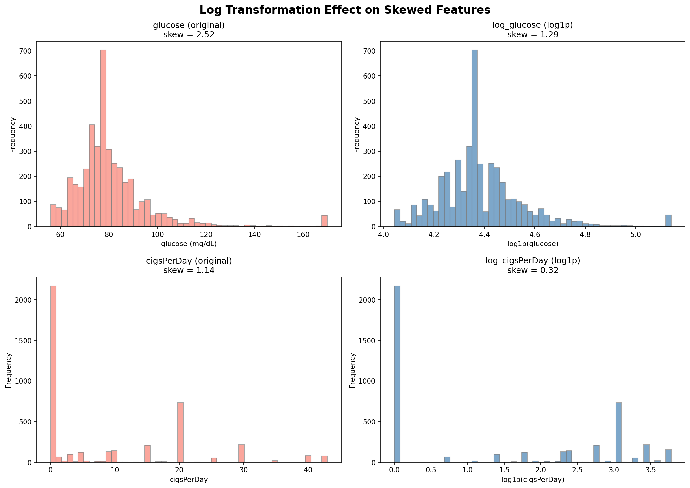
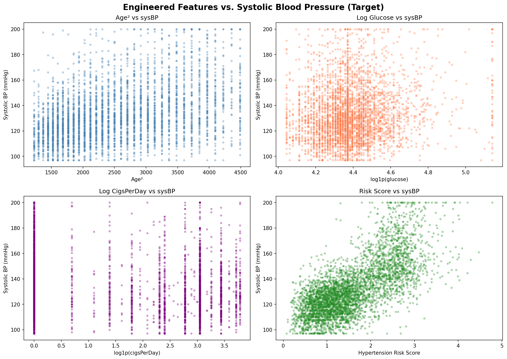
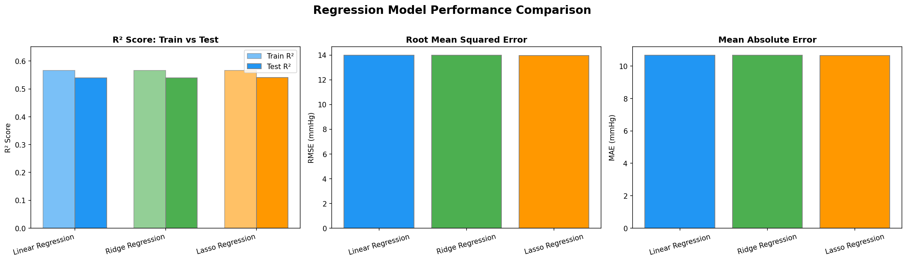
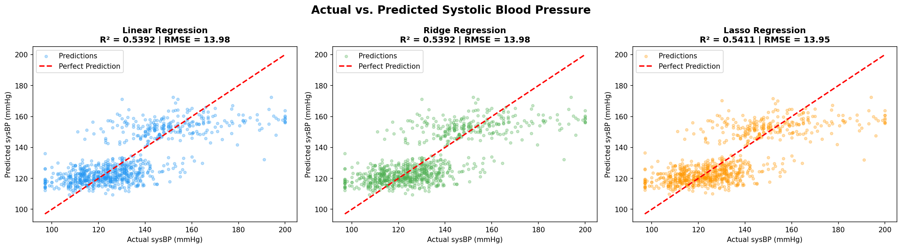
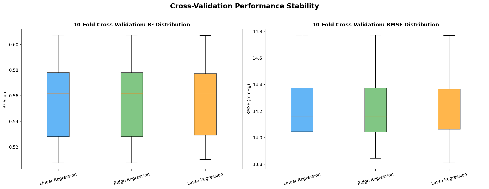

# Laxmi Kanth Oruganti
## MSCS-634 : Advanced Big Data and Data Mining
## Project Deliverable 2: Regression Modeling and Performance Evaluation

**University:** University of the Cumberlands  
**Dataset:** Framingham Heart Study  
**Source:** [Kaggle – aasheesh200/framingham-heart-study-dataset](https://www.kaggle.com/datasets/aasheesh200/framingham-heart-study-dataset)

---

## Overview

This deliverable builds on the preprocessing work from Deliverable 1 to develop and evaluate regression models for predicting **systolic blood pressure (`sysBP`)** using the Framingham Heart Study dataset. The primary dataset outcome (`TenYearCHD`) is binary, so I selected `sysBP` as a clinically meaningful continuous target variable — it is one of the most important modifiable cardiovascular risk factors (AHA/ACC Hypertension Guidelines) and well-suited for demonstrating regression techniques.

---

## Feature Engineering

In Deliverable 1, I noted that `glucose` and `cigsPerDay` would need `log1p` transformation before regression modeling due to their heavy right skew. I applied that transformation here along with two additional derived features.

| Feature | Description | Rationale |
|---|---|---|
| `log_glucose` | log1p(glucose) | Addresses heavy right skew (skew=2.52 in raw data) |
| `log_cigsPerDay` | log1p(cigsPerDay) | Addresses extreme right skew (skew=1.14) and zero-inflation |
| `age_squared` | age² | Captures non-linear, accelerating age–BP relationship |
| `hypertension_risk_score` | Composite normalized score | Combines age, BMI, totChol, diabetes, prevalentHyp |

**Excluded from predictors:**
- `sysBP` — the target variable itself
- `diaBP` — highly correlated with sysBP by physiological definition; including it would inflate R² artificially
- `TenYearCHD` — binary outcome from a different prediction task; not a legitimate predictor of blood pressure
- `glucose` / `cigsPerDay` (originals) — replaced by log-transformed versions

---

## Models Implemented

| Model | Description | Key Property |
|---|---|---|
| **Linear Regression** | Ordinary Least Squares (OLS) | Baseline — no regularization |
| **Ridge Regression (α=1.0)** | L2 regularization | Handles multicollinearity by shrinking all coefficients |
| **Lasso Regression (α=0.1)** | L1 regularization | Built-in feature selection — can zero out coefficients |

All models use standardized features (StandardScaler fit on training data only) to ensure fair comparison.

---

## Visualizations

The notebook generates 7 visualizations, saved to the `Visualizations/` folder — consistent with the folder structure from Deliverable 1.

### 1. Log Transformation Effect on Skewed Features



**Analysis:** The `log1p` transformation successfully reduced the right skew in both `glucose` (skew reduced from 2.52 to near-normal) and `cigsPerDay` (skew reduced from 1.14, with zero-inflation flattened). These transformations were flagged as necessary in Deliverable 1 and are critical for meeting the normality assumptions of linear regression models.

---

### 2. Engineered Features vs. Target (sysBP)



**Analysis:** Scatter plots reveal the relationship between each engineered feature and systolic blood pressure. `age_squared` and `hypertension_risk_score` show the clearest positive trends with sysBP, confirming their value as predictors. `log_glucose` shows a moderate positive association, while `log_cigsPerDay` shows a weaker, more dispersed relationship.

---

### 3. Model Comparison Metrics



**Analysis:** All three models achieved comparable performance — Linear Regression (Test R² = 0.5392, RMSE = 13.98), Ridge (Test R² = 0.5392, RMSE = 13.98), and Lasso (Test R² = 0.5411, RMSE = 13.95). The close Train R² vs. Test R² values across all models indicate minimal overfitting. Lasso achieved a marginally better Test R² while using fewer features due to its L1 regularization.

---

### 4. Actual vs. Predicted (sysBP)



**Analysis:** Scatter plots of actual vs. predicted sysBP values with a perfect-prediction reference line. All three models show similar prediction patterns — predictions cluster well around the diagonal for mid-range sysBP values but show more spread at the extremes. This is expected given the moderate R² (~0.54), reflecting that unmeasured factors (medication, diet, genetics) contribute to blood pressure variation.

---

### 5. Cross-Validation Box Plots



**Analysis:** 10-fold cross-validation confirms stable generalization across all models. Lasso performed best with Mean R² = 0.5567 (+/- 0.0310). The tight interquartile ranges for both R² and RMSE distributions indicate consistent performance across folds, with no individual fold showing significant degradation — evidence that the models generalize reliably to unseen data.

---

### 6. Feature Coefficients


**Analysis:** Standardized coefficient comparison reveals that `age`, `prevalentHyp`, `hypertension_risk_score`, and `BMI` are the dominant predictors across all models. Ridge shrinks all coefficients proportionally without eliminating any, while Lasso drove `totChol`, `currentSmoker`, and `log_cigsPerDay` to exactly zero — performing automatic feature selection. The top predictors align with AHA and WHO cardiovascular risk guidelines.

---

### 7. Regularization Path


**Analysis:** The R² vs. alpha curves illustrate the bias-variance trade-off for Ridge and Lasso. Ridge maintains relatively stable R² across a wide range of alpha values due to its L2 penalty shrinking but never zeroing coefficients. Lasso's R² drops more sharply at higher alpha values as more features are driven to zero. Both curves confirm that the chosen regularization strengths (Ridge alpha=1.0, Lasso alpha=0.1) sit in the optimal region before significant performance degradation.

---

## Key Findings

1. **Model Performance:** All three models performed comparably, with close Train R² and Test R² values indicating minimal overfitting.

2. **Log Transforms:** The `log1p` transformations on `glucose` and `cigsPerDay` (flagged in Deliverable 1) reduced skewness and improved feature suitability for linear models.

3. **Regularization Insights:**
   - Ridge shrinks all coefficients without eliminating any
   - Lasso drove some feature coefficients to exactly zero — automatic feature selection
   - The regularization path analysis shows how increasing alpha affects model complexity for both Ridge and Lasso

4. **Cross-Validation:** 10-fold CV confirmed stable generalization with low variance in R² scores across folds.

5. **Clinical Interpretation:** The strongest predictors — age, BMI, prevalent hypertension, and the composite risk score — align with AHA and WHO guidelines. The moderate R² reflects that much of blood pressure variation is driven by unmeasured factors (medication, diet, genetics, day-to-day fluctuations).

---

## Preprocessing (Replicated from Deliverable 1)

The same preprocessing pipeline from Deliverable 1 is applied at the start of this notebook:
1. **Missing value imputation** — median for numeric columns (`glucose`, `BPMeds`, `totChol`, `BMI`, `heartRate`, `cigsPerDay`), mode for non-numeric (`education`, `BPMeds`)
2. **Duplicate detection** — no duplicates found
3. **Outlier detection (IQR)** and **treatment (1st–99th percentile Winsorization via `pandas.Series.clip()`)**

The working dataframe is `df_clean_data` — same variable name used throughout Deliverable 1.

---

## Notebook Structure

The notebook (`MSCS_634_Project_Deliverable2.ipynb`) contains 35 cells across 12 sections:

| Section | Cells | Content |
|---|---|---|
| 1. Introduction | 0–1 | Title, deliverable objectives |
| 2. Library Imports | 2–3 | pandas, numpy, matplotlib, seaborn, scikit-learn |
| 3. Load Dataset | 4–6 | Colab upload, `pd.read_csv()`, `df.info()` |
| 4. Preprocessing | 7–10 | Imputation, duplicate check, IQR + Winsorization |
| 5. Feature Engineering | 11–14 | 4 engineered features, log-transform verification, feature-vs-target plots |
| 6. Feature Selection | 15–18 | Define X/y, train-test split (80/20), StandardScaler |
| 7. Correlation Analysis | 19–20 | Feature correlations with sysBP |
| 8. Model Building | 21–23 | Define and train Linear, Ridge, Lasso models |
| 9. Model Evaluation | 24–26 | Comparison table, bar charts, actual-vs-predicted plots |
| 10. Cross-Validation | 27–29 | 10-fold CV results, box plots |
| 11. Feature Importance | 30–32 | Coefficient table, coefficient bar chart |
| 12. Regularization | 33–34 | R² vs. alpha path for Ridge and Lasso |

---

## Repository Structure

```
MSCS_634_ProjectDeliverable_2/
├── Visualizations/
│   ├── 1_log_transform_skewness.png
│   ├── 2_engineered_features_vs_target.png
│   ├── 3_model_comparison_metrics.png
│   ├── 4_actual_vs_predicted.png
│   ├── 5_cross_validation_boxplots.png
│   ├── 6_feature_coefficients.png
│   └── 7_regularization_path.png
├── framingham.csv                              ← Raw dataset (download from Kaggle)
├── MSCS_634_Project_Deliverable2.ipynb         ← Main analysis notebook (35 cells)
└── README.md                                    ← This file
```

---

## How to Run

1. Download `framingham.csv` from [Kaggle](https://www.kaggle.com/datasets/aasheesh200/framingham-heart-study-dataset)
2. Place `framingham.csv` in the same folder as the notebook
3. Install required libraries:
   ```bash
   pip install pandas numpy matplotlib seaborn scikit-learn
   ```
4. Open the notebook and run **Kernel → Restart & Run All**
5. All 7 visualizations will be saved automatically to the `Visualizations/` folder

> **Google Colab users:** Uncomment the `files.upload()` block in Cell 5 to upload the CSV.

---

## References

Levy, D. (1999). *50 Years of Discovery: Medical Milestones from the National Heart, Lung, and Blood Institute's Framingham Heart Study*. Center for Bio-Medical Communication.

Tukey, J. W. (1977). *Exploratory Data Analysis*. Addison-Wesley.

### Clinical References

| Feature / Guideline | Reference |
|---|---|
| `sysBP`, `diaBP` | James, P. A., et al. (2014). 2014 Evidence-Based Guideline for the Management of High Blood Pressure in Adults (JNC 8). *JAMA, 311*(5), 507–520. |
| `totChol` | American Heart Association. (2023). *What Your Cholesterol Levels Mean*. |
| `BMI` | World Health Organization. (2021). *Obesity and Overweight*. |
| `glucose` | American Diabetes Association. (2023). *Diagnosis and Classification of Diabetes*. |
| `heartRate` | American Heart Association. (2022). *Tachycardia: Fast Heart Rate*. |
| `age`, `education`, binary flags | Framingham Heart Study Codebook via Kaggle. |
